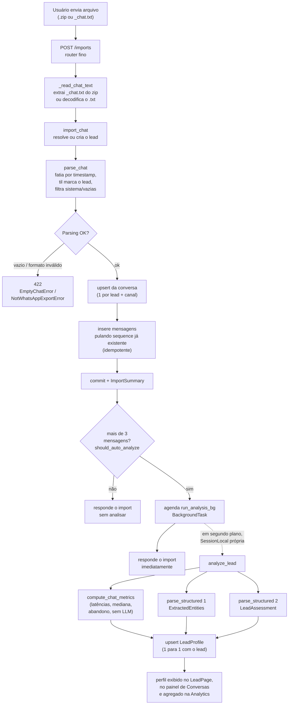

### Importação de conversas e análise comportamental por IA

Esta subseção detalha dois fluxos lógicos que andam juntos no Captus: a importação de conversas exportadas do WhatsApp e a análise comportamental do lead feita com um modelo de linguagem (LLM). O primeiro fluxo traz para dentro do sistema o histórico bruto de uma negociação que aconteceu fora dele, no aplicativo de mensagens. O segundo lê esse histórico e o transforma em um perfil estruturado do lead: quem é a pessoa, quais são suas dores e desejos, em que estágio da conversa de vendas ela está, e qual a chance de fechar. A ideia central é que o vendedor não precisa mais reler conversas longas para lembrar do contexto: o sistema decodifica a conversa por ele.

#### Por que importar em vez de integrar direto com a Meta

A forma "oficial" de um sistema externo conversar com o WhatsApp é a WhatsApp Business API da Meta. Ela é robusta, porém burocrática: exige conta verificada, aprovação de número, provedor homologado (BSP) e um processo de cadastro que leva tempo. Para um projeto que precisa funcionar agora, com conversas que já existem, esse caminho é pesado demais. A solução adotada é mais simples e direta: o próprio WhatsApp permite exportar uma conversa como um arquivo (o `_chat.txt`, normalmente dentro de um `.zip` com as mídias). O Captus lê esse arquivo e reconstrói a conversa no banco. Trata-se de uma versão 0 (v0) da futura integração via API: o formato de dados é o mesmo (conversas e mensagens), então quando a integração oficial for ligada, a camada de armazenamento e de análise já estará pronta para recebê-la.

#### O parser: como o arquivo exportado vira mensagens

Cada linha de uma exportação do WhatsApp segue um formato fixo: um timestamp entre colchetes, o nome do remetente, e o corpo da mensagem. Por exemplo: `[30/10/2025, 14:03:21] ~Dr. Paulo: Quero saber sobre a imersão`. O detalhe que organiza tudo é o til (`~`): no formato exportado, o remetente que é um contato externo (ou seja, o lead) aparece com til na frente do nome, enquanto as mensagens do dono da conta (o vendedor) vêm sem til. O parser usa esse sinal para decidir de quem é cada mensagem, gravando um booleano `sent` onde `True` significa vendedor e `False` significa lead.

O parsing (em `app/services/whatsapp_parser.py`) acontece em duas etapas. Primeiro, o texto é fatiado em blocos usando o timestamp como fronteira: toda vez que aparece um carimbo de data/hora, começa uma mensagem nova. Isso é importante porque uma única mensagem pode ter várias linhas (alguém aperta Enter no meio do texto), e o fatiamento por fronteira de timestamp mantém esse texto multi-linha junto, como um bloco só. Depois, cada bloco é casado contra uma expressão regular que separa timestamp, remetente e corpo:

```python
# app/services/whatsapp_parser.py
_TS_BOUNDARY = re.compile(r"\[(\d{2}/\d{2}/\d{4}, \d{2}:\d{2}:\d{2})\]")
_MSG = re.compile(r"\[(\d{2}/\d{2}/\d{4}, \d{2}:\d{2}:\d{2})\] ([^:]+): (.+)", re.DOTALL)
...
sender = sender.strip()
sent = not sender.startswith("~")  # vendedor não tem til
```

Ao longo do caminho, o parser faz uma limpeza que evita lixo no banco. Mensagens de sistema em português (o aviso de criptografia de ponta a ponta, o aviso de conversa iniciada por anúncio no Facebook) são filtradas. Caracteres invisíveis de marcação de direção de texto (o U+200E que o WhatsApp insere) são removidos. Mídias (áudios, imagens, documentos, anexos ocultos) não têm conteúdo textual aproveitável, então viram um marcador legível em português no lugar do texto, como `[áudio]`, `[imagem]` ou `[documento]`. Cada mensagem que sobra recebe um número de ordem (`sequence`), contíguo e começando em zero, atribuído depois da filtragem. Esse número é a peça-chave da idempotência, como será explicado adiante. Por fim, dois auxiliares cuidam de casos de borda: `infer_lead_name` descobre o nome do lead pegando o remetente com til mais frequente (sem o til), e `phone_from_filename` extrai o telefone do nome de arquivos no padrão `WhatsApp Chat - <telefone>.zip`. Se o arquivo estiver vazio ou não tiver nenhum timestamp no formato esperado, o parser levanta erros tipados (`EmptyChatError` e `NotWhatsAppExportError`), que o sistema converte em uma resposta de erro clara.

#### Da rota ao banco: conversas, mensagens e idempotência

O fluxo de importação é orquestrado por uma rota fina (`POST /imports`, em `app/api/routes/imports.py`) que delega o trabalho ao serviço. A rota recebe o upload, e se for um `.zip` ela abre o arquivo e procura o membro `_chat.txt` dentro dele; se for um `.txt` direto, apenas decodifica o conteúdo em UTF-8. Em seguida, o serviço `import_chat` (em `app/services/imports.py`) resolve para qual lead a conversa pertence: pode ser um lead já existente (informado por id), um lead identificado pelo telefone do nome do arquivo (com deduplicação por `external_user_id`), ou um lead novo criado a partir de um nome. Resolvido o lead, o serviço garante a existência de uma conversa para aquele lead.

No banco (modelos em `app/models/conversation.py`), há duas tabelas. A tabela `conversations` guarda uma conversa por lead e por canal, garantida por uma restrição de unicidade `UNIQUE(lead_id, channel)`: importar o mesmo lead duas vezes não cria duas conversas, apenas reaproveita a que já existe. A tabela `messages` guarda cada mensagem com seu texto, o booleano `sent`, o timestamp e a tal `sequence`. A restrição que torna toda a importação segura para repetir é a unicidade da sequência dentro da conversa:

```python
# app/models/conversation.py
UniqueConstraint("conversation_id", "sequence", name="uq_messages_conversation_sequence")
```

É isso que torna a importação idempotente, ou seja, segura para rodar de novo sem efeitos colaterais. Quando o mesmo arquivo é importado uma segunda vez, o serviço primeiro lê quais números de sequência já existem na conversa e simplesmente pula esses ao inserir, contando apenas as mensagens realmente novas. Reimportar a mesma conversa não duplica nada; reimportar uma conversa que cresceu (ganhou mensagens novas no fim) acrescenta só o trecho novo. Esse mesmo desenho serve à carga em lote: o script `scripts/populate_chats.py` percorre uma pasta inteira de exportações reais e, como cada lead é gravado individualmente, um lote interrompido no meio pode ser retomado de onde parou sem reprocessar o que já entrou. Esse script foi usado na carga de cold-start do corpus real (a turma Imersão Out/25), importando centenas de leads de uma vez, cada um já com sua conversa, seu perfil de IA e o desfecho comercial classificado.

#### Como a análise é disparada

A análise comportamental nunca trava a importação, e isso é uma decisão de projeto. Existem três formas de dispará-la. A primeira é automática, logo após uma importação bem-sucedida (ou após o envio de uma mensagem manual): se a conversa passar de três mensagens, o sistema agenda a análise. O limiar de três mensagens evita gastar uma chamada de LLM em conversas vazias ou que mal começaram, onde não há contexto suficiente para extrair um perfil. Esse gate é uma função simples e testável:

```python
# app/services/analysis.py
AUTO_ANALYZE_MIN_MESSAGES = 3

def should_auto_analyze(message_count: int) -> bool:
    return message_count > AUTO_ANALYZE_MIN_MESSAGES
```

A segunda forma é manual, sob demanda, através do endpoint `POST /leads/{id}/analyze`. Ele roda a análise de forma síncrona e devolve o perfil atualizado na hora, útil quando o vendedor quer forçar um reprocessamento depois de uma conversa nova. A terceira forma é o pano de fundo de tudo: a análise automática roda como uma tarefa em segundo plano (`BackgroundTask` do FastAPI), executada por `run_analysis_bg`. Essa tarefa abre a sua própria sessão de banco (`SessionLocal`), separada da sessão do request que já foi respondido, e envolve a análise inteira em um tratamento de erro que registra a falha mas a engole. A consequência prática é que, se o LLM estiver fora do ar ou a análise falhar por qualquer motivo, a importação continua valendo: as mensagens já estão salvas, e só o perfil de IA fica faltando (podendo ser gerado depois pelo endpoint manual). A análise é um enriquecimento, não uma dependência do dado bruto.

```python
# app/services/analysis.py
def run_analysis_bg(lead_id: int) -> None:
    try:
        with SessionLocal() as db:
            analyze_lead(db, lead_id)
    except Exception:  # falha de análise não pode quebrar o import
        logger.exception("Falha na análise automática do lead %s", lead_id)
```

#### A análise com LLM: por que duas chamadas em vez de uma

O coração da análise é a função `analyze_lead`. Ela carrega a conversa do lead, monta um transcrito legível (cada linha prefixada com `Lead:` ou `Vendedor:`), calcula as métricas deterministas e então conversa com o modelo de linguagem. O ponto mais importante do desenho é que a análise faz **duas** chamadas de saída estruturada, e não uma só. Saída estruturada significa que pedimos ao modelo que devolva os dados já no formato de um schema Pydantic conhecido (via `client.messages.parse(output_format=...)`), em vez de texto livre que precisaríamos depois interpretar à mão.

A razão de serem duas chamadas é uma lição aprendida na prática. A primeira tentativa usava um único schema grande, com cerca de quatorze campos somando texto, listas e enumerações. A API da Anthropic, ao preparar a saída estruturada, compila uma "gramática" que força o modelo a respeitar exatamente aquele formato, e um schema grande demais estourava o tempo desse compilador, retornando o erro `Grammar compilation timed out`. A correção não foi mudar a forma de chamar a API, e sim diminuir o tamanho de cada schema: dois schemas pequenos compilam rápido. Daí a regra adotada no projeto, registrada no próprio código: mantenha cada `output_format` enxuto (algo em torno de oito a dez campos) e prefira dividir em vez de empilhar muitos campos com enumerações em um schema único.

```python
# app/services/analysis.py: duas chamadas pequenas, não um schema único grande
entities: ExtractedEntities = parse_structured(
    model=settings.model_extraction, system=ANALYSIS_SYSTEM_PROMPT,
    messages=[{"role": "user", "content": user_content}],
    output_format=ExtractedEntities, max_tokens=1500,
)
assessment: LeadAssessment = parse_structured(
    model=settings.model_extraction, system=ANALYSIS_SYSTEM_PROMPT,
    messages=[{"role": "user", "content": user_content}],
    output_format=LeadAssessment, max_tokens=1500,
)
```

A primeira chamada usa o schema `ExtractedEntities` e cuida da **decodificação**: extrai os fatos objetivos que aparecem na fala do lead. São a especialidade (implantodontista, protesista, e assim por diante), o nível de experiência, a cidade/estado, o curso de interesse, e três listas centrais para vendas consultivas: as dores verbalizadas (problemas da prática clínica, como "dependo do laboratório"), os desejos expressos (o que o lead busca, como "quero autonomia") e as objeções de venda (barreiras à compra, como "achei caro" ou "vou pensar", que o prompt cuida de não confundir com dores). Há ainda um campo `comentarios` que reúne informações úteis variadas: equipamentos e softwares citados, termos técnicos e marcadores de contexto. Um detalhe técnico relevante para a gramática: esse schema não usa campos opcionais, porque uma união com `null` viraria um `anyOf` e incharia a gramática; em vez disso, ausência de evidência é representada por string vazia ou lista vazia, e o sistema normaliza essas strings vazias para `None` na hora de salvar.

A segunda chamada usa o schema `LeadAssessment` e faz a **avaliação** estratégica do diálogo. Ela classifica o lead em uma das quatro personas da MR Digital (Iniciado Digital, Especialista Analógico, Recém-Especializado, Focado em Prótese, ou indeterminado quando não há sinais suficientes), com uma confiança de 0 a 1 e uma justificativa. Define o estágio SPIN atual da conversa, que descreve a maturidade do diálogo de vendas seguindo a metodologia SPIN: Situação, Problema, Implicação e Necessidade. É importante não confundir esse estágio SPIN, que é uma propriedade da conversa, com o estágio comercial do funil (Kanban), que é uma propriedade do negócio (deal); são dois conceitos distintos que o sistema nunca mistura. O SPIN é sempre uma enumeração fixa (`SPINStage`), nunca texto livre, decisão de produto para garantir consistência. O schema também devolve um `lead_score` de 0 a 100, estimando a maturidade e a probabilidade de conversão, e um resumo conciso da situação. O prompt que guia as duas chamadas (em `app/prompts/analysis.py`) é compartilhado e traz, além das definições, exemplos curtos de classificação SPIN (por exemplo, "Quero informações sobre a imersão" indica estágio de situação, enquanto "Perco horas de cadeira e a confiança do paciente fica abalada" indica implicação), o que ajuda o modelo a calibrar o julgamento.

A análise ainda é "update-aware": quando o lead já tem um perfil, o perfil atual é incluído no conteúdo enviado ao modelo, com a instrução de revisar apenas o que mudou. Assim, reprocessar uma conversa que cresceu refina o perfil em vez de jogá-lo fora.

#### As métricas deterministas da conversa

Nem tudo precisa de inteligência artificial. Algumas informações valiosas podem ser calculadas diretamente dos timestamps, sem custo de LLM e sem margem de erro de interpretação. É o que faz `compute_chat_metrics`, uma função pura (sem banco e sem modelo) que recebe as mensagens ordenadas e mede o ritmo da conversa. A ideia é olhar para cada "virada" de remetente, ou seja, cada vez que quem fala muda de lado. Quando o lead manda uma mensagem e em seguida o vendedor responde, o intervalo entre as duas é a latência do vendedor; quando o vendedor fala e o lead responde depois, o intervalo é a latência do lead. Dessas listas de intervalos, a função tira a mediana (mais robusta a valores extremos do que a média), além de registrar a latência da primeira resposta do vendedor.

A função também detecta abandono de forma simples e confiável: se a última mensagem da conversa foi do vendedor, significa que o lead parou de responder, e a conversa é marcada como abandonada (`is_abandoned`). Esse sinal determinista tem um papel curioso na análise de IA: o modelo sempre devolve um "estágio SPIN de abandono" (onde a conversa esfriou), mas esse valor só é de fato persistido quando a métrica determinista confirma que houve abandono. Em outras palavras, é o cálculo objetivo dos timestamps, e não o LLM, que decide se a conversa esfriou; o LLM só rotula em que ponto da venda isso aconteceu. Vale notar uma degradação graciosa: importações sem timestamp simplesmente não geram latências (os pares sem horário são ignorados), então as métricas ficam nulas sem quebrar nada.

#### Persistência no LeadProfile e uso posterior

Todo o resultado é consolidado em uma única tabela, `lead_profiles` (modelo em `app/models/lead_profile.py`), que tem relação um para um com o lead, garantida por `UNIQUE(lead_id)`. A gravação é um upsert: existe um único registro de perfil por lead, e cada nova análise atualiza a mesma linha em vez de criar uma nova. A função `analyze_lead` busca o perfil existente (ou cria um novo), aplica sobre ele as entidades, a avaliação e as métricas, e dá commit. As listas (dores, desejos, objeções, comentários) e o objeto bruto da resposta são guardados como JSONB; a persona é gravada já com seu rótulo de exibição em português; o estágio SPIN, que é enumeração no schema, é gravado como texto.

A tabela abaixo resume os campos do `LeadProfile` agrupados por origem, deixando claro o que vem do LLM e o que é calculado deterministicamente:

| Origem | Campos | Como é produzido |
|---|---|---|
| Entidades (`ExtractedEntities`, 1ª chamada LLM) | `especialidade`, `experiencia`, `cidade_estado`, `course_interest`, `dores_verbalizadas`, `desejos_expressos`, `objecoes`, `comentarios` | Extração estruturada das falas do lead pelo modelo |
| Avaliação (`LeadAssessment`, 2ª chamada LLM) | `matched_persona`, `persona_confidence`, `persona_reasoning`, `current_spin_stage`, `abandon_spin_stage`, `lead_score`, `summary` | Classificação e julgamento estratégico pelo modelo |
| Métricas (`compute_chat_metrics`, sem LLM) | `median_seller_latency_seconds`, `median_lead_latency_seconds`, `first_response_latency_seconds`, `last_message_sent`, `is_abandoned` | Cálculo determinista a partir dos timestamps |
| Metadados | `model_used`, `raw`, `created_at`, `updated_at` | Rastreabilidade da análise (modelo usado e resposta bruta) |

Depois de gravado, o perfil é a fonte única de verdade para várias telas. O endpoint de detalhe do lead embute o perfil, e a página do lead (LeadPage) renderiza a seção "Análise da conversa (IA)" com o resumo, o score, o estágio SPIN traduzido, a especialidade, a experiência, as latências, a marcação de abandono e os chips de dores, desejos, objeções e comentários, além de tingir o avatar conforme a persona. O painel direito da página de Conversas mostra uma versão compacta (persona, score, SPIN, dores e desejos). E, num nível mais alto, a página de Analytics agrega esses perfis individuais em métricas do conjunto: a Analytics é construída sobre as análises por lead, mas não é o `LeadProfile` em si, são camadas distintas. Assim, o caminho completo fecha o ciclo: uma conversa de WhatsApp exportada entra como texto bruto, vira mensagens estruturadas, e termina como um perfil que o vendedor pode ler em segundos.

#### Diagrama do fluxo


