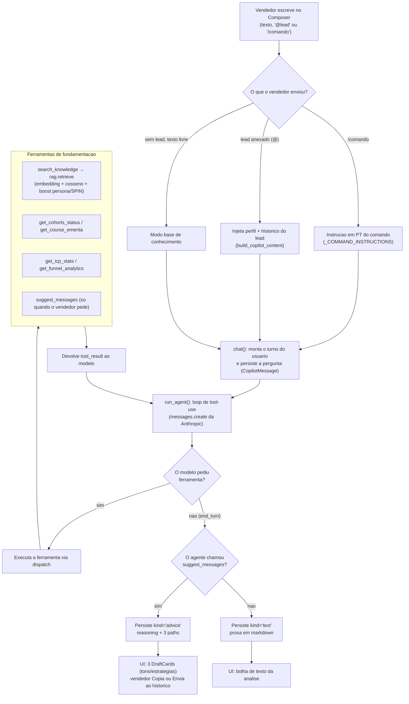

### Copiloto: atendimento assistido por IA (RAG)

O Copiloto é a quarta funcionalidade do Captus e, de certa forma, o ponto onde tudo o que o sistema já sabe sobre um lead vira ação prática. A ideia central, que vale repetir porque muda completamente o desenho do produto, é esta: o Copiloto NÃO é um robô que conversa com o lead no lugar do vendedor. Ele não envia mensagens sozinho, não responde automaticamente no WhatsApp e não toma decisões comerciais por ninguém. O Copiloto é um consultor que fica do lado do vendedor, lê o contexto, busca o material certo da empresa e devolve uma recomendação para que o vendedor, esse sim, decida o próximo passo e aperte o botão de enviar. O próprio prompt do sistema deixa isso explícito logo na primeira linha: "Seu papel é ACONSELHAR O VENDEDOR: você NÃO conversa com o lead nem envia mensagens automaticamente."

Essa escolha tem uma consequência direta no comportamento padrão. Por padrão, o agente responde em prosa, analisando o lead e respondendo perguntas, do mesmo jeito que um colega de equipe mais experiente faria numa conversa de bastidor. Ele só monta sugestões de mensagem prontas quando o vendedor pede de forma explícita ("como respondo?", "me dá sugestões"). Sem esse pedido, ele continua sendo um consultor que orienta, não um gerador de textos.

#### O que o Copiloto faz e como o vendedor conversa com ele

A interface do Copiloto (página `Copiloto.jsx`, com a lógica de estado em `useCopilot.js`) lembra um chat moderno, com uma barra lateral de sessões à esquerda e a conversa à direita. O vendedor digita num campo único e tem três gestos possíveis dentro desse mesmo campo: escrever uma pergunta normal, digitar "@" para anexar um lead, ou digitar "/" para disparar um comando. A detecção de qual gesto está em jogo é feita por expressões regulares aplicadas ao final do que está sendo digitado, em `useCopilot.js`:

```js
const slash = val.match(/^\/([\w-]*)$/)        // abre o menu de comandos
const m = val.match(/(^|\s)@([^\s@]*)$/u)       // abre o seletor de leads
```

Cada turno de conversa é persistido no banco. Existem duas tabelas próprias do Copiloto, `CopilotSession` (a sessão, que aparece na barra lateral) e `CopilotMessage` (cada mensagem trocada), e é importante notar que elas são distintas das mensagens de WhatsApp entre lead e vendedor. Uma coisa é o histórico real da conversa com o cliente, outra coisa é o histórico de conselhos que o vendedor pediu ao Copiloto. Cada sessão fica normalmente ligada a um lead, de modo que o vendedor pode voltar depois e reabrir a conversa de aconselhamento sobre aquele cliente específico.

#### Fluxo de RAG: buscar o trecho certo por similaridade de sentido

RAG quer dizer "geração aumentada por recuperação". Na prática, antes de o modelo escrever qualquer coisa sobre os dados da empresa, ele busca na base de conhecimento da MR os trechos mais parecidos com o que está em jogo, e responde fundamentado nesses trechos, em vez de responder "de memória". Isso evita que o agente invente cursos, preços ou argumentos que não existem.

A peça que faz essa busca é a função `retrieve`, em `app/services/rag.py`. O caminho é o seguinte. Primeiro, o texto da consulta é transformado num vetor de números (um "embedding") que representa o sentido daquele texto. Depois, o banco PostgreSQL, com a extensão pgvector, compara esse vetor com os vetores de todos os trechos guardados, usando a distância de cosseno (o operador `<=>` do pgvector), e devolve os mais próximos. Distância de cosseno, de forma simples, é uma medida de "quão parecido em significado" um texto é de outro: quanto menor a distância, mais parecidos. A geração de embeddings (`embed_query` e `embed_texts`) é uma decisão consciente do projeto: ela usa a OpenAI (`text-embedding-3-small`, 1536 dimensões), enquanto toda a geração de texto continua na Anthropic (Claude).

As fontes desse conhecimento são variadas e ficam todas na tabela `knowledge_chunks`, cada uma com um campo `source` que diz de onde veio: o grafo legado da MR (`kb_graph`), o playbook em markdown com a filosofia e os scripts SPIN (`playbook`), e o conteúdo dos cursos (`course`, do qual falaremos mais adiante). Entre esses trechos há um tipo especial, os de rótulo `Script`, que carregam duas marcações extras: a persona a que se destinam (por exemplo, "Especialista Analógico") e o estágio SPIN da venda (Situação, Problema, Implicação, Necessidade).

É aqui que entra o que o projeto chama de "boost". Quando o Copiloto sabe a persona e o estágio SPIN do lead, ele passa essas duas informações para o `retrieve`, que então prioriza os scripts feitos exatamente para aquela combinação, elevando-os ao topo da lista, com a distância de cosseno servindo como critério de desempate. O trecho que implementa isso é curto e direto, em `app/services/rag.py`:

```python
boost = case(
    (
        (KnowledgeChunk.label == "Script")
        & (KnowledgeChunk.persona == persona)
        & (KnowledgeChunk.spin_stage == spin_stage),
        0,
    ),
    else_=1,
)
order_by.append(boost.asc())   # 0 sobe, 1 desce
order_by.append(distance.asc())  # cosseno como desempate
```

Na leitura simples: trechos do tipo Script que batem persona e estágio recebem valor 0 e vão para frente; todos os outros recebem 1 e ficam atrás; dentro de cada grupo, ordena-se pela proximidade de sentido. O resultado é que o vendedor recebe o argumento certo para o cliente certo, no momento certo da conversa. Sem persona ou sem estágio, o `retrieve` simplesmente devolve os trechos mais próximos por cosseno, sem priorização especial.

#### O loop do agente com ferramentas (tool use)

O Copiloto é um agente, e não apenas uma única chamada ao modelo. Isso significa que o modelo pode pedir para usar ferramentas, receber o resultado e continuar raciocinando, repetindo esse ciclo até concluir a resposta. O motor desse ciclo é a função `run_agent`, em `app/services/llm/client.py`. Ela roda o loop manual de tool-use do SDK da Anthropic: enquanto o modelo sinaliza que quer uma ferramenta (`stop_reason == "tool_use"`), o código executa o que foi pedido, devolve o resultado e deixa o modelo seguir; quando o modelo encerra o turno, a resposta final é retornada.

As ferramentas são montadas em `app/services/copilot.py`, na função `_build_tools`. São seis no total, e vale descrevê-las porque elas definem o que o Copiloto consegue "saber" antes de aconselhar:

| Ferramenta | Para que serve |
|---|---|
| `search_knowledge(query, persona?, spin_stage?)` | Busca no RAG (playbook, dossiês de persona, scripts SPIN). É aqui que entra o boost por persona e estágio. |
| `get_cohorts_status(course_name?)` | Consulta o status real das turmas: datas, capacidade, situação e preço por vaga. |
| `get_course_ementa(course_name)` | Detalha um curso: resumo e grade curricular, a partir do conteúdo dos cursos. |
| `get_icp_stats()` | Estatísticas de ICP por persona: número de leads, taxa de conversão, dores e desejos agregados. |
| `get_funnel_analytics()` | Métricas do funil: conversão geral e por estágio, latências de resposta, taxa de abandono. |
| `suggest_messages(reasoning, paths)` | Ferramenta opcional. O agente só a chama quando o vendedor pede sugestões de mensagem; ela captura a análise e os 3 caminhos estratégicos. |

Um detalhe de robustez que merece nota: cada handler de ferramenta é à prova de exceção. Se algo der errado numa busca ou numa consulta ao banco, o handler devolve uma string de erro em vez de levantar uma exceção. Isso garante que o loop do agente sempre receba um resultado e consiga terminar, em vez de travar no meio. A definição de uma ferramenta, no código, junta a descrição em português (que orienta o modelo sobre quando usá-la) ao esquema de entrada:

```python
{
    "name": "search_knowledge",
    "description": (
        "Busca na base de conhecimento da MR (playbook, dossiês de persona e scripts "
        "SPIN)... Passe persona e spin_stage quando souber, para priorizar os scripts."
    ),
    "input_schema": SEARCH_KNOWLEDGE_SCHEMA,
}
```

Quando o turno termina, a função `chat` decide como guardar a resposta: se o agente chamou `suggest_messages`, a mensagem é persistida com `kind='advice'` (os caminhos estratégicos capturados); caso contrário, com `kind='text'` (a resposta conversacional em markdown). Essa distinção é o que a interface usa depois para escolher entre mostrar uma bolha de texto ou os cartões de sugestão.

#### Os slash commands (o menu de "/")

Os slash commands são atalhos para tarefas analíticas que o vendedor faz com frequência. Ao digitar "/", abre-se um menu (`CommandMenu.jsx`) com os comandos disponíveis, e escolher um deles dispara um fluxo já preparado no backend. No código, cada comando vira uma instrução em português que orienta o agente a chamar a ferramenta certa, em `_COMMAND_INSTRUCTIONS` (arquivo `app/services/copilot.py`). Por exemplo, o `/analytics` instrui o agente a chamar `get_funnel_analytics` e resumir as taxas de conversão, as latências e a taxa de abandono. Os comandos têm precedência sobre o resto: quando há um comando, é a instrução dele que comanda o turno.

| Comando | O que dispara |
|---|---|
| `/icp` | Análise de ICP: chama `get_icp_stats` e resume personas, conversão por persona e top dores/desejos. |
| `/analytics` | Análise do funil: chama `get_funnel_analytics` e resume conversão, latências e abandono. |
| `/courses` | Portfólio de cursos: usa `get_course_ementa` e/ou `search_knowledge` e resume os cursos e suas ementas. |
| `/spin` | Metodologia SPIN: busca os scripts e técnicas SPIN no playbook e explica como aplicá-los. |

#### Anexar um lead com "@" (injeção de contexto)

Quando o vendedor digita "@", abre-se um seletor de leads filtrável por nome (`MentionMenu`), e escolher um lead o anexa à sessão. Anexar não é um gesto cosmético: ele injeta, dentro do turno enviado ao agente, todo o contexto que o sistema já produziu sobre aquele lead. Isso inclui o perfil gerado pela análise de IA da etapa anterior (persona, dores verbalizadas, desejos, objeções, estágio SPIN, resumo) e também o histórico real da conversa de WhatsApp entre o lead e o vendedor. Essa montagem fica na função `build_copilot_content`, em `app/prompts/copilot.py`, que produz um bloco de contexto legível com cabeçalhos como "## LEAD ANEXADO" e "## CONVERSA (WhatsApp)".

Na prática, é isso que faz a diferença entre um conselho genérico e um conselho sob medida. Com o perfil em mãos, o agente sabe que está diante, por exemplo, de um Especialista Analógico com objeção de tempo, e que a conversa está no estágio de Implicação; com isso, ao chamar `search_knowledge`, ele passa persona e estágio e recebe, pelo boost, justamente os scripts pensados para esse caso. No frontend, o vínculo lead↔sessão é tratado como fixo: cada lead anexado corresponde a uma sessão, e trocar de lead numa sessão que já tem um lead leva a uma confirmação de "nova conversa", o que evita o dessincronismo entre o que aparece na tela e o que está vinculado no banco.

#### A saída: rascunhos de resposta em tons e estratégias diferentes

Quando o vendedor pede sugestões de mensagem, o agente chama `suggest_messages` e devolve uma análise mais três caminhos estratégicos distintos. É importante a palavra "distintos": o prompt pede que sejam estratégias diferentes de abordagem (por exemplo, "ancorar na dor de previsibilidade", "gatilho de escassez da próxima turma", "prova social mais ROI"), e não apenas três variações de tom da mesma frase. Cada caminho traz um título curto, o racional (por que aquela abordagem faz sentido para aquele lead agora) e a mensagem de WhatsApp pronta, em português, escrita num tom consultivo e terminando com uma pergunta que ajude a avançar o funil.

Na tela, cada caminho vira um cartão (`DraftCard.jsx`) com dois botões: Copiar, que usa a área de transferência do navegador e dá um retorno visual rápido, e Enviar, que grava aquele texto no histórico de WhatsApp do lead anexado. Vale reforçar o ponto de partida: mesmo o botão Enviar grava no histórico do próprio sistema, não dispara nada automaticamente para o cliente. A interface inclusive lembra isso embaixo do campo: "As mensagens são sugestões, revise antes de enviar ao histórico do lead." O vendedor segue no controle, escolhe a estratégia, ajusta o texto se quiser e só então decide o que fazer.

#### Conteúdo vivo: editar a ementa de um curso realimenta o Copiloto

Um aspecto elegante do desenho é que o conhecimento do Copiloto não fica congelado. Quando alguém edita o conteúdo de um curso no sistema (cria, altera ou exclui um módulo), o backend agenda automaticamente uma re-ingestão daquele curso no RAG, sem que ninguém precise rodar script algum. Isso acontece na rota de catálogo (`app/api/routes/catalog.py`), que dispara `reingest_course_bg` como tarefa em segundo plano após o CRUD de módulo.

A re-ingestão em si está em `app/services/course_rag.py`. A lógica é "apagar e reinserir" por curso: ela remove os trechos antigos daquele curso (identificados pelo prefixo `course:{course_id}#` no campo `node_ref`), monta um trecho por módulo, gera os embeddings com `rag.embed_texts` e grava de volta. Por trabalhar isolada por curso e por prefixo, a operação é idempotente (pode rodar de novo sem duplicar) e não toca nas outras fontes, como o grafo legado ou o playbook. E como a função de busca `retrieve` é agnóstica em relação à fonte, o efeito é direto: assim que a ementa atualizada é re-embedada, o Copiloto já passa a recuperar e citar o conteúdo novo, sem nenhuma mudança no código do agente. Por segurança, a tarefa engole e apenas registra qualquer erro de re-ingestão, justamente para que uma falha de embedding nunca derrube a edição do curso.

#### Diagrama do turno de chat

O diagrama abaixo resume o caminho de um turno do Copiloto, da entrada do vendedor até os rascunhos ou a resposta em prosa. O fonte está em `relatorio_ciclo2/diagramas/copiloto_fluxo.mmd`.


