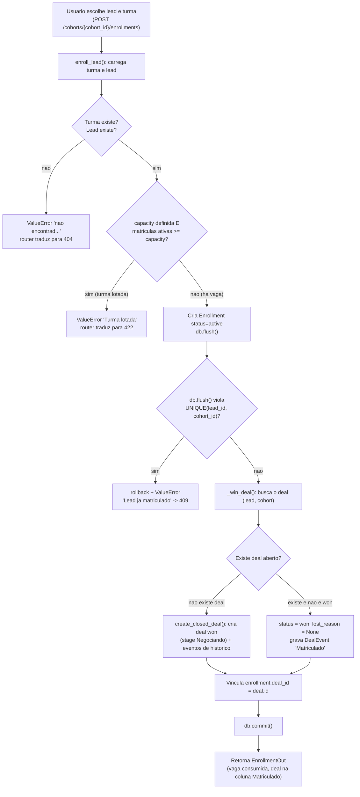

### Fluxos da camada CRUD: leads, funil e matrícula

Esta subseção descreve, de forma verbal e detalhada, os principais fluxos lógicos da camada que conecta a interface ao banco de dados persistente. No Captus essa camada não é um conjunto solto de operações de criar, ler, atualizar e apagar registros: ela carrega as regras de negócio do processo comercial de venda de cursos. Cadastrar um lead, mover um card no funil e matricular um aluno são ações que, por baixo, disparam várias escritas coordenadas (o registro principal, o histórico e os vínculos entre tabelas), tudo dentro de uma mesma transação. O objetivo aqui é explicar essas mecânicas uma a uma, sempre apoiado no código real que está no diretório `app/services/` do backend.

Antes de entrar em cada fluxo, vale fixar o padrão arquitetural que se repete em todos eles, porque ele explica a forma de cada função que vem a seguir. A camada é organizada em três degraus: o roteador (em `app/api/routes/`), o serviço (em `app/services/`) e os modelos ORM (em `app/models/`). O roteador é fino de propósito: ele só recebe a requisição HTTP, valida o corpo contra um schema Pydantic, chama o serviço correspondente e devolve a resposta. Toda a regra de negócio (deduplicação, controle de vagas, transições do funil, escrita do histórico) vive no serviço. Os serviços, por sua vez, sinalizam violações de regra de duas maneiras: ou levantam diretamente uma `HTTPException` (quando o serviço já está acoplado ao HTTP, como em `leads.py` e `deals.py`), ou levantam um `ValueError` com mensagem em português, deixando para o roteador a tradução desse erro no código HTTP certo (caminho usado em `catalog.py`, `course_modules.py` e `enrollments.py`). A regra de tradução é simples e consistente: mensagem com "não encontrado" vira 404, conflito de unicidade ("já existe", "já matriculado") vira 409, e violação de regra de processo (turma lotada, motivo de perda ausente, estágio inválido) vira 422.

#### Cadastro de lead (REQF01): deduplicação, deal inicial e primeiro evento

O cadastro de um lead é o ponto de entrada do funil. A função `create_lead`, em `app/services/leads.py`, faz três coisas numa única transação: cria o lead, abre o primeiro deal dele numa turma e grava o primeiro evento de histórico desse deal. A ordem importa, porque cada passo depende do `id` gerado no passo anterior.

O primeiro cuidado é a deduplicação de e-mail, que atende a exigência da REQF01 de não cadastrar o mesmo lead duas vezes. Antes de qualquer escrita, o serviço consulta se já existe um lead com aquele e-mail e, se existir, levanta um conflito (409):

```python
# app/services/leads.py
if payload.email:
    if db.scalar(select(Lead).where(Lead.email == payload.email)) is not None:
        raise HTTPException(status_code=409, detail="Já existe um lead com este email")
```

Essa checagem no nível da aplicação é a primeira linha de defesa, voltada para dar uma mensagem clara ao usuário. A garantia de verdade, porém, está no banco: o modelo `Lead` (em `app/models/lead.py`) declara um índice único parcial chamado `uq_leads_email_present`, definido sobre a coluna `email` apenas quando ela não é nula (`postgresql_where=text("email IS NOT NULL")`). Isso resolve um detalhe importante do domínio: leads importados de conversas de WhatsApp muitas vezes não têm e-mail, então vários registros podem ter `email` nulo ao mesmo tempo (o índice parcial ignora os nulos), mas dois leads jamais podem compartilhar o mesmo e-mail preenchido. O índice parcial é exatamente o que permite as duas coisas conviverem.

Confirmado que não há duplicidade, o serviço busca a turma escolhida (404 se ela não existir) e descobre quem é o vendedor corrente. Como a autenticação foi deliberadamente adiada neste ciclo, o "usuário corrente" é resolvido de forma implícita: a função auxiliar `_current_seller` simplesmente pega o primeiro usuário com papel de vendedor cadastrado (a Dra. Ana Costa, do seed). Esse vendedor vira o responsável (`assignee_id`) do lead e o autor dos eventos de histórico.

Com isso, a função cria três registros em sequência, intercalando `db.flush()` para obter os identificadores: primeiro o `Lead`; depois um `Deal` apontando para a turma, já posicionado na coluna inicial do funil (`stage=Novo`, `status=open`); e por fim um `DealEvent` que marca o nascimento do deal, com motivo "Lead criado". Só ao final é que vem o `db.commit()`, de modo que ou tudo é gravado, ou nada é. O retorno é um `DealCard`, o mesmo formato que o quadro Kanban consome, então o card já aparece pronto na coluna "Novo" assim que o lead é cadastrado. Vale notar que o histórico (REQF02) começa a ser escrito aqui, no cadastro, e não só nas movimentações posteriores: o primeiro evento da vida de um deal é a sua própria criação.

#### Pipeline e funil (REQF02): mapeamento de coluna para (stage, status) e histórico

O quadro Kanban da interface mostra colunas planas, como o vendedor espera ver: Novo, Contatado, Negociando, Aprovado, Matriculado e Perdido. O modelo de dados, porém, não guarda uma única coluna: ele separa dois campos no deal, o `stage` (posição no funil) e o `status` (estado terminal: aberto, ganho ou perdido). Essa separação é uma decisão de projeto importante, porque "Matriculado" e "Perdido" não são posições do funil, são desfechos. Toda a tradução entre o conceito de coluna da tela e o par de campos do banco vive em `app/services/deals.py`, em duas funções complementares.

A leitura (banco para tela) é feita por `card_column`, que decide qual coluna exibir a partir do status: se o deal foi ganho, mostra "Matriculado"; se foi perdido, mostra "Perdido"; caso contrário, mostra o próprio `stage` (que é uma das colunas abertas).

A escrita (tela para banco) é feita por `move_deal`, que recebe a coluna de destino e a converte de volta nos campos de domínio. As colunas abertas (Novo, Contatado, Negociando, Aprovado) viram `stage` igual à coluna com `status=open`; "Matriculado" vira `status=won`; e "Perdido" vira `status=lost`, mas só depois de exigir um motivo. O trecho central é este:

```python
# app/services/deals.py
if column in OPEN_COLUMNS:
    deal.stage = DealStage(column)
    deal.status = DealStatus.OPEN
    deal.lost_reason = None
elif column == MATRICULADO:
    deal.status = DealStatus.WON
    deal.lost_reason = None
else:  # PERDIDO
    if not (move.lost_reason and move.lost_reason.strip()):
        raise HTTPException(
            status_code=422, detail="lost_reason é obrigatório para mover a Perdido"
        )
    deal.status = DealStatus.LOST
    deal.lost_reason = move.lost_reason.strip()
```

A regra de que mover para "Perdido" exige um motivo é uma regra de processo comercial, não só uma validação técnica: a empresa quer entender por que perde alunos. Por isso, se o motivo vier vazio, a operação é recusada com 422 e nada é gravado. Repare também que, ao reabrir um deal (voltar para uma coluna aberta) ou ao matriculá-lo, o `lost_reason` é zerado, evitando que um motivo de perda antigo fique pendurado num deal que voltou a estar em jogo.

O segundo pilar da REQF02 é o histórico. Toda transição, sem exceção, grava um `DealEvent` antes do commit, e esse evento registra de onde veio e para onde foi, tanto em `stage` quanto em `status`, além do motivo (quando é uma perda) e do autor. A função guarda o `from_stage`/`from_status` logo no começo, antes de alterar o deal, justamente para conseguir registrar o "antes" e o "depois". Assim, a linha do tempo de cada deal fica reconstituível: dá para saber quando ele entrou em cada coluna, quando foi ganho ou perdido e por quê.

A tabela abaixo resume o mapeamento completo entre a coluna do quadro e o par (stage, status):

| Coluna no quadro (UI) | stage gravado | status gravado | Observações |
|---|---|---|---|
| Novo | Novo | open | coluna inicial; também atribuída no cadastro do lead |
| Contatado | Contatado | open | |
| Negociando | Negociando | open | |
| Aprovado | Aprovado | open | última coluna aberta antes do desfecho |
| Matriculado | (mantém o stage atual) | won | desfecho de ganho; integra-se à matrícula (REQF06) |
| Perdido | (mantém o stage atual) | lost | exige `lost_reason`; sem motivo retorna 422 |

Vale registrar que existem outros dois caminhos de escrita de deals em `deals.py`, usados fora do arrasto manual no quadro. O `create_deal_for_lead` cria um deal aberto para um lead que já existe, numa turma e estágio escolhidos (cenário do lead que nasceu de uma importação de conversa e depois é posicionado no funil); ele aceita apenas estágios abertos e bloqueia a duplicidade de deal na mesma turma com 409. Já o `create_closed_deal` cria um deal que já nasce fechado (ganho ou perdido), usado na carga histórica de dados (cold start), quando a turma já aconteceu; ele é idempotente sobre o par (lead, turma), ou seja, se já houver um deal para aquela combinação, devolve o existente em vez de duplicar, respeitando a restrição `UNIQUE(lead_id, cohort_id)`.

#### Matrícula e vagas (REQF06): efetivar o aluno e controlar a lotação

A matrícula é o ponto em que o processo comercial encontra a operação do curso. Matricular um lead numa turma não é só marcar um campo: é a fonte da verdade de quem efetivamente está naquela turma, e, ao mesmo tempo, precisa refletir no funil, levando o deal correspondente para o desfecho de ganho. Tudo isso vive em `app/services/enrollments.py`, na função `enroll_lead`, que coordena três preocupações: o controle de vagas, a criação da matrícula e a transição do deal.

O controle de vagas segue uma regra direta: o número de vagas disponíveis é a capacidade da turma menos o número de matrículas ativas. Só matrículas com status `active` contam vaga; matrículas canceladas não ocupam lugar. Antes de criar qualquer coisa, o serviço conta as matrículas ativas e, se elas já alcançaram a capacidade, bloqueia a operação:

```python
# app/services/enrollments.py
if cohort.capacity is not None and _active_count(db, cohort_id) >= cohort.capacity:
    raise ValueError("Turma lotada")
```

Esse `ValueError` é traduzido pelo roteador para um 422, comunicando ao usuário que a turma está lotada. A checagem só acontece quando a turma tem capacidade definida; turmas sem capacidade declarada (`capacity` nulo) não impõem limite. Passada a checagem de vaga, o serviço cria a `Enrollment` com status `active` e tenta o `db.flush()`. Aqui entra uma segunda barreira, agora no nível do banco: o modelo `Enrollment` (em `app/models/enrollment.py`) tem a restrição `UNIQUE(lead_id, cohort_id)`, então, se o mesmo lead já estiver matriculado naquela turma, o flush viola a unicidade, a transação é desfeita e o serviço levanta um erro que o roteador traduz para 409. É a mesma filosofia do cadastro de lead: uma checagem amigável quando possível, e uma garantia dura no banco para fechar a porta de uma vez.

Criada a matrícula, falta amarrá-la ao funil. Isso é feito pela função auxiliar `_win_deal`, que busca o deal daquele lead naquela turma e o leva para ganho. Há dois caminhos. Se já existe um deal aberto, ele recebe `status=won`, tem o eventual `lost_reason` zerado e ganha um `DealEvent` registrando a transição com motivo "Matriculado". Se não existe deal nenhum (situação possível quando alguém é matriculado diretamente, sem ter passado pelo funil), o serviço reaproveita o `create_closed_deal` de `deals.py` para criar um deal já ganho, com o histórico correspondente. Nos dois casos, o resultado é um deal em estado de ganho, que a leitura do quadro vai exibir na coluna "Matriculado". Por fim, o `enrollment.deal_id` é preenchido com o id desse deal, materializando o vínculo entre a matrícula e o deal, e só então vem o `db.commit()`. Esse vínculo é o que permite, no cancelamento, saber exatamente qual deal reverter.

O cancelamento, em `cancel_enrollment`, é o espelho da matrícula e é o que efetivamente libera a vaga. Ele localiza a matrícula ativa do lead naquela turma (404 se não houver) e muda seu status para `cancelled`. Como o controle de vagas conta apenas matrículas ativas, mudar o status para cancelado já devolve a vaga ao bolo disponível, sem precisar apagar registro nenhum (o histórico da matrícula fica preservado). Em seguida, se a matrícula estava vinculada a um deal ganho, o cancelamento reverte esse deal para o funil aberto, colocando-o de volta em `status=open` e `stage=Negociando`, e grava um `DealEvent` com motivo "Matrícula cancelada". Ou seja, o lead volta a aparecer no quadro como uma negociação em aberto, pronto para ser retomado. Há ainda a função de leitura `cohort_enrollments`, que monta o resumo de ocupação de uma turma (capacidade, total de ativos e vagas disponíveis), aplicando a mesma conta de capacidade menos matrículas ativas para o campo `available`.

O diagrama a seguir resume o caminho feliz e os pontos de bloqueio do fluxo de matrícula, do momento em que o usuário escolhe o lead e a turma até o deal ficar na coluna "Matriculado".



#### Catálogo e conteúdo do curso: cursos, turmas e a ementa por módulos

A camada de catálogo cuida dos dados de referência que sustentam todo o resto: os cursos e suas turmas. Ela está em `app/services/catalog.py` e é o exemplo mais puro do padrão de serviço por `ValueError`. A leitura é feita por `list_courses`, que traz os cursos com suas turmas já carregadas (usando `selectinload` para evitar consultas repetidas). A escrita cobre criar e editar cursos e turmas, sem operação de exclusão. Em `create_course` e `update_course`, a regra de negócio relevante é o nome único do curso: como essa unicidade é garantida no banco, o serviço deixa o `db.commit()` tentar, captura o `IntegrityError`, desfaz a transação e o converte num `ValueError` "Curso já existe", que o roteador traduz para 409. Já `create_cohort` e `update_cohort` validam a existência da entidade pai (o curso, no caso da criação de turma) e levantam "não encontrado" quando ela falta, virando 404 no roteador. As edições usam `model_dump(exclude_unset=True)`, o que significa que só os campos efetivamente enviados na requisição são alterados, deixando os demais intactos (atualização parcial).

O conteúdo do curso, isto é, a ementa, é tratado num serviço próprio, `app/services/course_modules.py`, porque a ementa é editável por módulos no banco. Cada módulo é uma linha (`CourseModule`) com título, conteúdo, posição e carga, ligada a um curso. O serviço oferece o CRUD completo dessas linhas: listar (ordenado por posição), criar, atualizar e, neste caso, também apagar. Ele segue o mesmo padrão: valida o curso ou o módulo e levanta "não encontrado" quando falta, deixando o roteador converter para 404.

A leitura consolidada da ementa acontece na rota `GET /courses/{course_id}/ementa`, em `app/api/routes/catalog.py`, e ela tem uma lógica de fallback que vale destacar. Se o curso já tem módulos cadastrados no banco, a ementa (`syllabus`) é montada a partir desses módulos. Se ainda não tem nenhum módulo, a rota cai para uma extração de bootstrap a partir de um arquivo de playbook, garantindo que a tela nunca apareça vazia mesmo antes de o conteúdo ter sido digitado no sistema. Outro ponto que diferencia as rotas de módulos das demais é o uso de `BackgroundTasks`: sempre que um módulo é criado, editado ou apagado, o roteador agenda em segundo plano a reingestão daquele curso na base de conhecimento usada pela IA (`reingest_course_bg`). Assim, a edição da ementa responde rápido ao usuário, e o reprocessamento do material para o copiloto acontece de forma assíncrona, sem travar a requisição.

#### O padrão que costura tudo

Olhando os quatro fluxos em conjunto, fica visível a mesma estrutura se repetindo, e é ela que dá previsibilidade ao sistema. O roteador permanece fino: recebe, valida o schema, delega e responde. O serviço concentra a regra de negócio e é o dono do acesso ao banco e da transação, sempre fechando com um `db.commit()` único ao final, de modo que operações compostas (lead mais deal mais evento; matrícula mais deal mais evento mais vínculo) sejam atômicas. As violações de regra viram erros tipados, traduzidos de forma consistente para os códigos HTTP: 404 para entidade inexistente, 409 para conflito de unicidade e 422 para regra de processo violada. E, por fim, o que precisa de garantia forte (e-mail único de lead, par único lead-turma na matrícula e no deal, nome único de curso) é protegido por restrições no próprio banco, com a checagem na aplicação servindo de camada amigável por cima. É esse conjunto de escolhas que faz a camada CRUD do Captus ser, de fato, a camada onde o processo comercial vira dado persistente e auditável.
